# Match Analysis
### Digging through Five Thirty Eight's match data


```r
library(tidyverse)
library(tidymodels)
library(expappr)
library(ggthemes)
library(lubridate)
library(ggrepel)

source("munge/helpers.R")
```


```r
spi_matches <- readRDS("./data/fivethirtyeight/spi_matches2018-09-22.RDS") %>% 
  mutate(match_id = row_number())
intl_rankings <- readRDS("./data/fivethirtyeight/intl_rankings2018-09-22.RDS")
club_rankings <- readRDS("./data/fivethirtyeight/club_rankings2018-09-22.RDS")
```

First, let's explore the data structure of each of these files


```r
spi_matches %>% 
  head() %>% 
  knitr::kable()
```


|date       | league_id|league                  |team1         |team2               |  spi1|  spi2|  prob1|  prob2| probtie| proj_score1| proj_score2| importance1| importance2| score1| score2|  xg1|  xg2| nsxg1| nsxg2| adj_score1| adj_score2| match_id|
|:----------|---------:|:-----------------------|:-------------|:-------------------|-----:|-----:|------:|------:|-------:|-----------:|-----------:|-----------:|-----------:|------:|------:|----:|----:|-----:|-----:|----------:|----------:|--------:|
|2016-08-12 |      1843|French Ligue 1          |Bastia        |Paris Saint-Germain | 51.16| 85.68| 0.0463| 0.8380|  0.1157|        0.91|        2.36|        32.4|        67.7|      0|      1| 0.97| 0.63|  0.43|  0.45|       0.00|       1.05|        1|
|2016-08-12 |      1843|French Ligue 1          |AS Monaco     |Guingamp            | 68.85| 56.48| 0.5714| 0.1669|  0.2617|        1.82|        0.86|        53.7|        22.9|      2|      2| 2.45| 0.77|  1.75|  0.42|       2.10|       2.10|        2|
|2016-08-13 |      2411|Barclays Premier League |Hull City     |Leicester City      | 53.57| 66.81| 0.3459| 0.3621|  0.2921|        1.16|        1.24|        38.1|        22.2|      2|      1| 0.85| 2.77|  0.17|  1.25|       2.10|       1.05|        3|
|2016-08-13 |      2411|Barclays Premier League |Burnley       |Swansea City        | 58.98| 59.74| 0.4482| 0.2663|  0.2854|        1.37|        1.05|        36.5|        29.1|      0|      1| 1.24| 1.84|  1.71|  1.56|       0.00|       1.05|        4|
|2016-08-13 |      2411|Barclays Premier League |Middlesbrough |Stoke City          | 56.32| 60.35| 0.4380| 0.2692|  0.2927|        1.30|        1.01|        33.9|        32.5|      1|      1| 1.40| 0.55|  1.13|  1.06|       1.05|       1.05|        5|
|2016-08-13 |      2411|Barclays Premier League |Southampton   |Watford             | 69.49| 59.33| 0.5759| 0.1874|  0.2367|        1.91|        1.05|        34.1|        30.7|      1|      1| 1.05| 0.22|  1.52|  0.41|       1.05|       1.05|        6|

#### Initial questions about the matches dataset:
- Does SPI change by match, or is it constant for each team across all matches?
- Does can I deduce home team from the columns? (Is home team = team1?)
- What are the nsxg columns and adj_score columns?
- Are second division matches captured? 

##### Leagues


```r
spi_matches %>% 
  group_by(league, league_id) %>% 
  summarise(num_matches = n()) %>% 
  arrange(league) %>% 
  knitr::kable()
```


|league                                   | league_id| num_matches|
|:----------------------------------------|---------:|-----------:|
|Argentina Primera Division               |      5641|         703|
|Australian A-League                      |      1948|         135|
|Austrian T-Mobile Bundesliga             |      1827|         312|
|Barclays Premier League                  |      2411|        1140|
|Belgian Jupiler League                   |      1832|         240|
|Brasileiro Série A                       |      2105|         760|
|Chinese Super League                     |      1979|         129|
|Danish SAS-Ligaen                        |      1837|         182|
|Dutch Eredivisie                         |      1849|         612|
|English League Championship              |      2412|        1109|
|English League One                       |      2413|         552|
|English League Two                       |      2414|         552|
|French Ligue 1                           |      1843|        1140|
|French Ligue 2                           |      1844|         760|
|German 2. Bundesliga                     |      1846|         612|
|German Bundesliga                        |      1845|         918|
|Greek Super League                       |      1884|         240|
|Italy Serie A                            |      1854|        1140|
|Italy Serie B                            |      1856|         814|
|Japanese J League                        |      1947|         147|
|Major League Soccer                      |      1951|         782|
|Mexican Primera Division Torneo Apertura |      1952|         320|
|Mexican Primera Division Torneo Clausura |      1975|         334|
|National Women's Soccer League           |      4582|         231|
|Norwegian Tippeligaen                    |      1859|         480|
|Portuguese Liga                          |      1864|         612|
|Russian Premier Liga                     |      1866|         480|
|Scottish Premiership                     |      2417|         426|
|South African ABSA Premier League        |      1983|         240|
|Spanish Primera Division                 |      1869|        1140|
|Spanish Segunda Division                 |      1871|         930|
|Swedish Allsvenskan                      |      1874|         480|
|Swiss Raiffeisen Super League            |      1879|         360|
|Turkish Turkcell Super Lig               |      1882|         611|
|UEFA Champions League                    |      1818|         346|
|UEFA Europa League                       |      1820|         349|
|United Soccer League                     |      2160|         561|

Great! We have second division data for England, France, Spain, Germany, and Italy upon first glance. It could be interesting to look at predicting promotion or relegation. 

##### SPI


```r
spi_matches %>% 
  select(match_id, date, team1, team2, spi1, spi2) %>%
  gather(team_num, team, team1:team2) %>% 
  gather(spi_num, spi, spi1:spi2) %>% 
  mutate(team_num = str_remove_all(team_num, "[^0-9]"),
         spi_num = str_remove_all(spi_num, "[^0-9]")) %>% 
  filter(team_num == spi_num, team == "Manchester City") %>% 
  ggplot(aes(date, spi)) +
  geom_point(aes(color = team_num)) +
  theme_expapp() +
  ggtitle("Manchester City's SPI Over Time")
```


Okay, so the SPI is current as of the match and is changing. There also seem to be about an equal number of records with team num = 1 as there are for 2. Let's verify that team1 is the home team, real quick.


```r
spi_matches %>% 
  head(10) %>% 
  select(date, league, team1, team2)
```

```
## # A tibble: 10 x 4
##    date       league                  team1           team2               
##    <date>     <chr>                   <chr>           <chr>               
##  1 2016-08-12 French Ligue 1          Bastia          Paris Saint-Germain 
##  2 2016-08-12 French Ligue 1          AS Monaco       Guingamp            
##  3 2016-08-13 Barclays Premier League Hull City       Leicester City      
##  4 2016-08-13 Barclays Premier League Burnley         Swansea City        
##  5 2016-08-13 Barclays Premier League Middlesbrough   Stoke City          
##  6 2016-08-13 Barclays Premier League Southampton     Watford             
##  7 2016-08-13 Barclays Premier League Everton         Tottenham Hotspur   
##  8 2016-08-13 Barclays Premier League Crystal Palace  West Bromwich Albion
##  9 2016-08-13 French Ligue 1          Bordeaux        St Etienne          
## 10 2016-08-13 Barclays Premier League Manchester City Sunderland
```

I've confirmed via google that team1 was the home team for each of these games. I supposed there will be some games in the dataset played on neutral grounds as well. 

### Tidying Up
Given the nastiness cleaning with team numbers above, I'll probably want to create a tidy version of this dataset. What should that look like? 
- 2 Records for each game
- 1 "team" column
- Home or away indicator
- All metrics for team first, and then "opponent metrics"
- Win or Loss
- Should allow me to easily calculate difference between spi and opponent spi this way. Maybe I should just include the difference, not the actual opponent data?


```r
home_teams <- spi_matches %>%
  select(-contains("2")) %>% 
  mutate(home = 1)

names(home_teams) <- names(home_teams) %>% str_remove("[0-9]")

home_teams <- home_teams %>%
  select(match_id, date, league, league_id, team, home, spi, prob, proj_score, importance, score, xg, nsxg, adj_score)

away_teams <- spi_matches %>%
  select(-contains("1")) %>% 
  mutate(home = 0)

names(away_teams) <- names(away_teams) %>% str_remove("[0-9]")

away_teams <- away_teams %>%
  select(match_id, date, league, league_id, team, home, spi, prob, proj_score, importance, score, xg, nsxg, adj_score)

spi_matches_combined <- comb_home_away(home_teams, away_teams)

# Season is the main other piece of data I'd like to add at this time
spi_matches %>%
  mutate(month = lubridate::month(date, label = TRUE),
         year = lubridate::year(date)) %>% 
  count(year, month) %>% 
  ggplot(aes(month, n)) +
  geom_col() +
  theme_expapp() +
  ggtitle("Total Matches by Month") +
  scale_y_continuous(labels = scales::comma, name = "Num Matches")
```

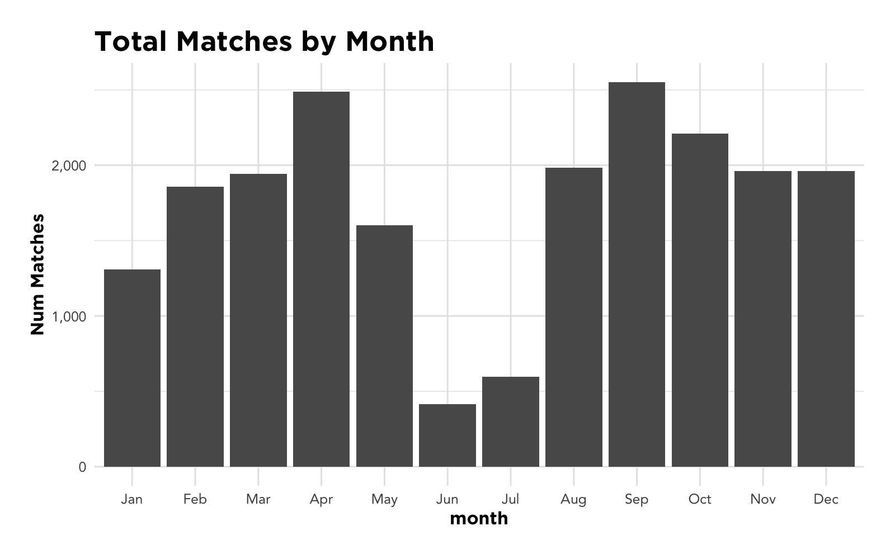

```r
spi_matches2 <- spi_matches %>% 
  mutate(season = get_season(date))

spi_matches_tidy <- spi_matches_combined %>% 
  mutate(season = get_season(date))
  
matches_past <- spi_matches_tidy %>% 
  filter(!is.na(score))

matches_future <- spi_matches_tidy %>% 
  anti_join(matches_past %>% distinct(match_id), by = "match_id") %>% 
  filter(date > lubridate::today())

#saveRDS(spi_matches_tidy, "./data/fivethirtyeight/spi_matches_tidy.RDS")
```

#### Tidy Summary
Wow, tidying this data up was much more difficult than expected, but I think I'm a good place now with it. Each match will have 2 records (one for each team). This will make it easier to filter by team and quickly analyze wins / losses and compare to the opponent. New fields:
- `home` - 1 (home) or 0 (away)
- `diff` - column for every metric (team's minus opponent's)
- `result` - win, loss, or tie
- `points` - 3 for a win, 1 for a tie, 0 for a loss
- `season` - factors from 2014-15 to 2021-22
# Exploratory Data Analysis
### Recreating League Tables
An interesting wrinkle is that some of these leagues are actually knockout tournaments, and we also have some match data for current seasons. I'd like to have a league reference table where I can quickly say whether a season is finished and whether it was a knockout tournament.


```r
matches_past %>% 
  group_by(league, season, team) %>% 
  summarise(games_played = n_distinct(match_id)) %>% 
  ungroup() %>%
  group_by(league, season) %>% 
  summarise(max_team_gms = max(games_played),
            min_team_gms = min(games_played)) %>% 
  filter(max_team_gms != min_team_gms) %>% 
  head()
```

```
## # A tibble: 6 x 4
## # Groups:   league [4]
##   league                       season  max_team_gms min_team_gms
##   <chr>                        <fct>          <dbl>        <dbl>
## 1 Argentina Primera Division   2018-19            5            4
## 2 Austrian T-Mobile Bundesliga 2017-18           35            1
## 3 Brasileiro Série A           2016-17           17           16
## 4 Brasileiro Série A           2017-18           38           15
## 5 Brasileiro Série A           2018-19           10            9
## 6 Chinese Super League         2018-19            9            8
```

Hmmmmm I'd hoped that looking at the descrepancy between max and min games played would tell me whether it was a tournament, but alot of genuine leagues have discrepancies in number of games played. I may just have to hard code that in. 


```r
season_results <- matches_past %>%
  filter(!(season %in% unique(matches_future$season))) %>% 
  group_by(league, season, team ) %>% 
  summarise(game_played = n(),
            points = sum(match_points),
            goal_diff = sum(diff_score, na.rm = TRUE)) %>% 
  ungroup() %>% 
  group_by(league, season) %>% 
  mutate(league_position = row_number(-points)) %>% 
  arrange(league, season, -points, -goal_diff)
```

### EPL 17-18 Final Standings


|team                     | game_played| points| goal_diff| league_position|
|:------------------------|-----------:|------:|---------:|---------------:|
|Manchester City          |          38|    100|        79|               1|
|Manchester United        |          38|     81|        40|               2|
|Tottenham Hotspur        |          38|     77|        38|               3|
|Liverpool                |          38|     75|        46|               4|
|Chelsea                  |          38|     70|        24|               5|
|Arsenal                  |          38|     63|        23|               6|
|Burnley                  |          38|     54|        -3|               7|
|Everton                  |          38|     49|       -14|               8|
|Leicester City           |          38|     47|        -4|               9|
|Newcastle                |          38|     44|        -8|              12|
|Crystal Palace           |          38|     44|       -10|              11|
|AFC Bournemouth          |          38|     44|       -16|              10|
|West Ham United          |          38|     42|       -20|              13|
|Watford                  |          38|     41|       -20|              14|
|Brighton and Hove Albion |          38|     40|       -20|              15|
|Huddersfield Town        |          38|     37|       -30|              16|
|Southampton              |          38|     36|       -19|              17|
|Swansea City             |          38|     33|       -28|              19|
|Stoke City               |          38|     33|       -33|              18|
|West Bromwich Albion     |          38|     31|       -25|              20|

```r
big_leagues <- c("Barclays Premier League", "French Ligue 1", "German Bundesliga", "Portuguese Liga", "Spanish Primera Division", "Italy Serie A") # leaving out champions league given tournament style

big_league_matches <- matches_past %>%
  filter(league %in% big_leagues, !(season %in% unique(matches_future$season))) ## removing incomplete seasons

season_results %>% 
  #filter(league %in% big_leagues) %>% 
  group_by(league, season) %>% 
  mutate(pts_ahead = points - lead(points),
         team_season = paste(team,season)) %>% 
  filter(league_position == 1,game_played >= 20) %>% ## should get rid of junk seasons and tourney
  ggplot(aes(reorder(team_season, pts_ahead), pts_ahead, fill = league %in% big_leagues)) +
  geom_col() +
  coord_flip() +
  ggtitle("Winning Team Margin of Victory by Season") +
  ylab("Margin of Victory - Points") + 
  xlab("Team") +
  theme_expapp() +
  scale_fill_discrete(name = "In big league?")
```

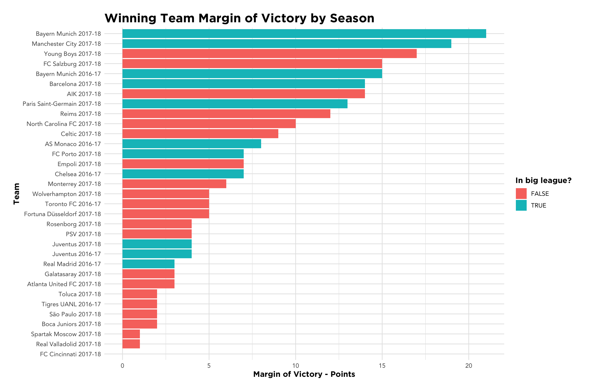

```r
matches_past %>% 
  group_by(league, season, home) %>% 
  summarise(matches_played = n_distinct(match_id),
            med_win_prob = median(prob),
            mean_win_prob = mean(prob)) %>% 
  filter(home == 1, matches_played > 25) %>% select(-home) %>% 
  mutate(league_season = paste(league, season)) %>% 
  ggplot(aes(matches_played, med_win_prob)) +
  geom_jitter(aes(color = season),size = 5, alpha = 0.7) +
  xlab("Matches Played") +
  ylab("Median Home Win %") +
  ggtitle("Expected Home Team Win Probability by Season") +
  theme_expapp() +
  scale_y_continuous(labels = scales::percent)
```


```r
matches_past %>% 
  group_by(league, season, home) %>% 
  summarise(matches_played = n_distinct(match_id),
            med_win_prob = median(prob),
            mean_win_prob = mean(prob)) %>% 
  filter(home == 1, matches_played > 25) %>% select(-home) %>% 
  mutate(league_season = paste(league, season)) %>% 
  arrange(-med_win_prob) %>% 
  head(10) %>% 
  knitr::kable()
```


|league                         |season  | matches_played| med_win_prob| mean_win_prob|league_season                          |
|:------------------------------|:-------|--------------:|------------:|-------------:|:--------------------------------------|
|Major League Soccer            |2018-19 |             81|      0.52910|     0.5113531|Major League Soccer 2018-19            |
|Major League Soccer            |2017-18 |            400|      0.50370|     0.5024210|Major League Soccer 2017-18            |
|Major League Soccer            |2016-17 |            237|      0.49660|     0.4772966|Major League Soccer 2016-17            |
|Brasileiro Série A             |2017-18 |            368|      0.48985|     0.4885329|Brasileiro Série A 2017-18             |
|National Women's Soccer League |2016-17 |             74|      0.48905|     0.4491905|National Women's Soccer League 2016-17 |
|Brasileiro Série A             |2018-19 |             92|      0.48765|     0.4960076|Brasileiro Série A 2018-19             |
|Brasileiro Série A             |2016-17 |            169|      0.48320|     0.4877994|Brasileiro Série A 2016-17             |
|Norwegian Tippeligaen          |2016-17 |            134|      0.47810|     0.4698963|Norwegian Tippeligaen 2016-17          |
|Spanish Primera Division       |2017-18 |            380|      0.47680|     0.4852058|Spanish Primera Division 2017-18       |
|Chinese Super League           |2018-19 |             65|      0.47670|     0.4598246|Chinese Super League 2018-19           |

Interesting, seems like there is a bit of a trend with MLS and the Brasilian league, fivethirtyeight's model expects them to win at home more often than other leagues. Next I'll compare this to reality - do they actually win at home more often?


```r
matches_past %>% 
  group_by(league, season, home) %>% 
  summarise(matches_played = n_distinct(match_id),
            med_win_prob = median(prob),
            mean_win_prob = mean(prob),
            actual_win_home = mean(match_result == "win")) %>% 
  filter(home == 1, matches_played > 25) %>% 
  mutate(act_less_exp = actual_win_home - med_win_prob) %>% 
  ggplot(aes(act_less_exp)) +
  geom_histogram(bins = 20, color = "white") +
  theme_expapp() +
  scale_x_continuous(labels = scales::percent, name = "Actual Win % minus expected win %") +
  ylab("Count of League Seasons") +
  ggtitle("Difference between Actual Home Win % and Expected", "By season, by league")
```

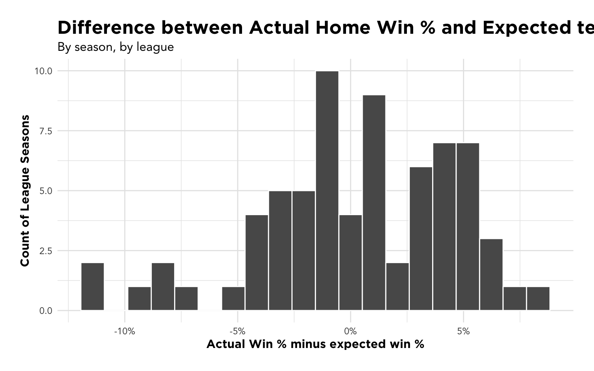

```r
league_seson_df <- matches_past %>% 
  filter(!(season %in% unique(matches_future$season)), league %in% big_leagues) %>% 
  mutate(league_season = paste(league,season)) %>% 
  distinct(league_season) %>% 
  arrange(league_season)

for (l in unique(league_seson_df$league_season)) {
  perf_plot <- matches_past %>% 
    mutate(league_season = paste(league, season)) %>% 
    filter(!(season %in% unique(matches_future$season)), league_season == l) %>% 
    inner_join(season_results, by = c("season", "league", "team")) %>% 
    group_by(league_season, league, season, team, league_position) %>% 
    summarise(matches_played = n_distinct(match_id),
              expected_win_pct = mean(prob),
              actual_win_pct = mean(match_result == "win")) %>% 
    mutate(win_pct_diff = actual_win_pct - expected_win_pct,
           winner = league_position == 1) %>% 
    filter(matches_played > 15) %>% 
    ggplot(aes(expected_win_pct, win_pct_diff, label = team, color = winner)) +
    geom_jitter(size = 3, alpha = 0.8, show.legend = FALSE) +
    scale_color_manual(values = c("black", "darkgreen")) +
    geom_text_repel(show.legend = FALSE) +
    geom_hline(yintercept = 0, linetype = "dashed", color = "red") +
    theme_expapp() +
    scale_x_continuous(labels = scales::percent, name = "Expected Win %") +
    scale_y_continuous(labels = scales::percent, name = "Actual - Expected") +
    ggtitle(paste(l, "Expected Win Pct vs Actual"), "Overperformers above red line, underperformers below")
  
  print(perf_plot)
  
}
```

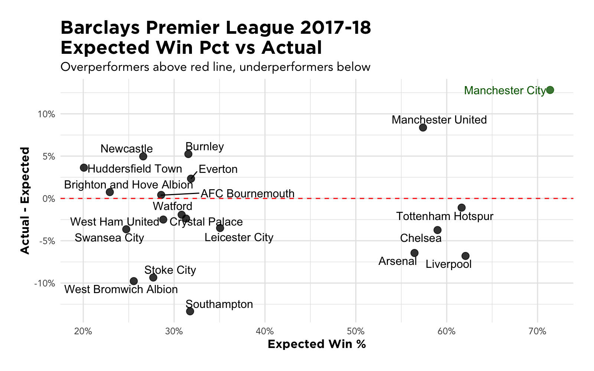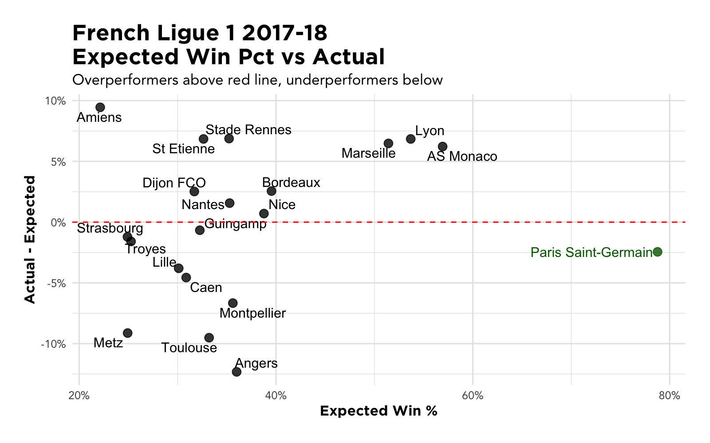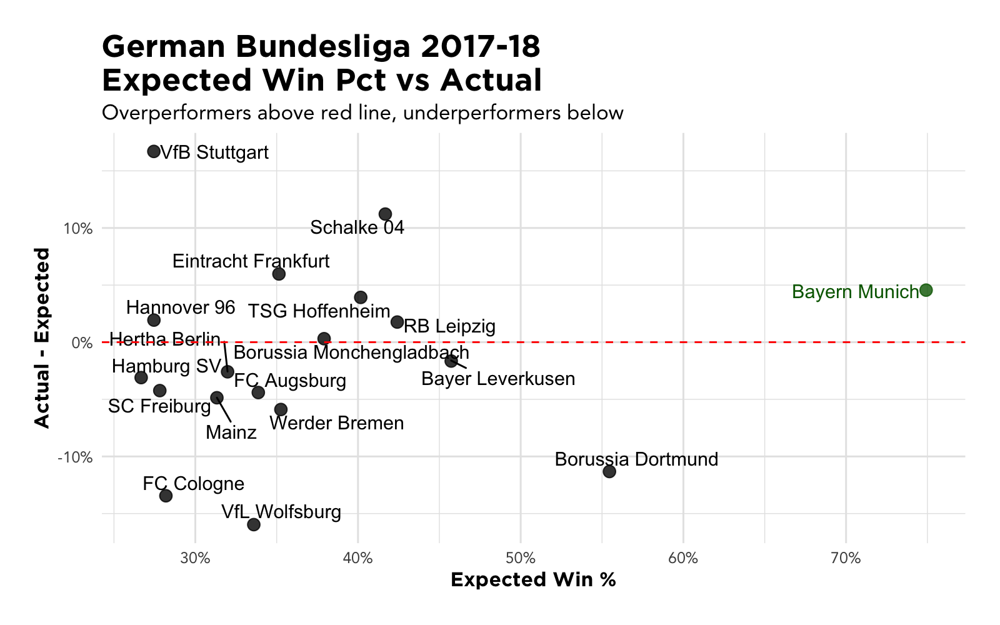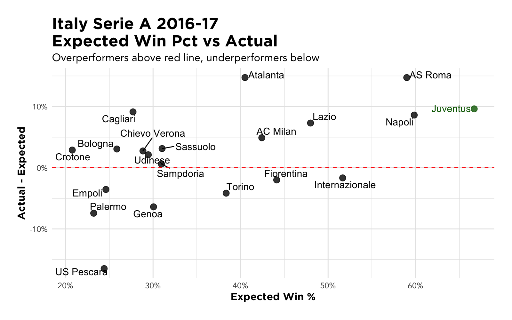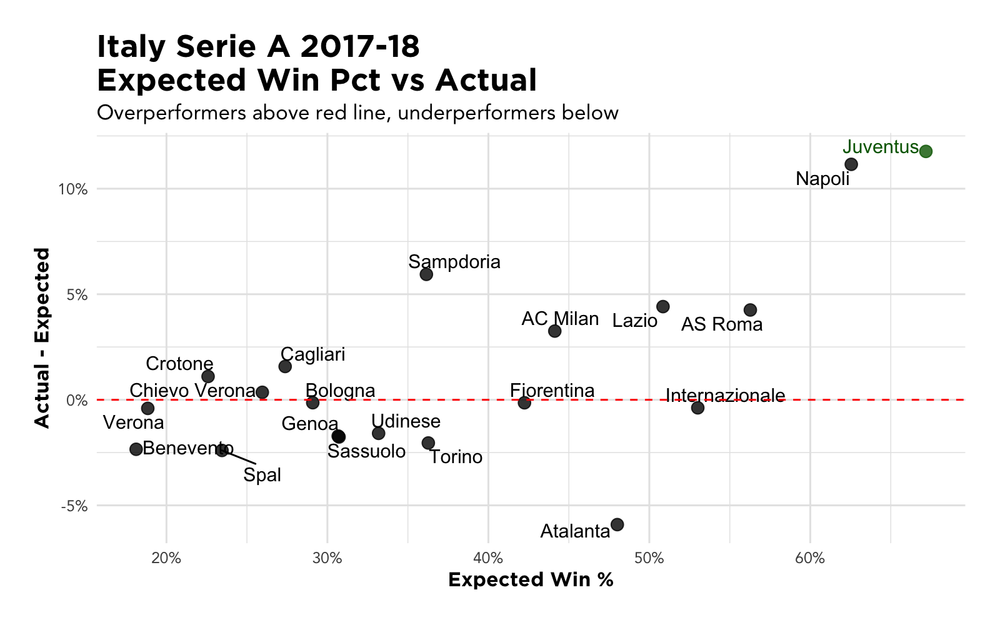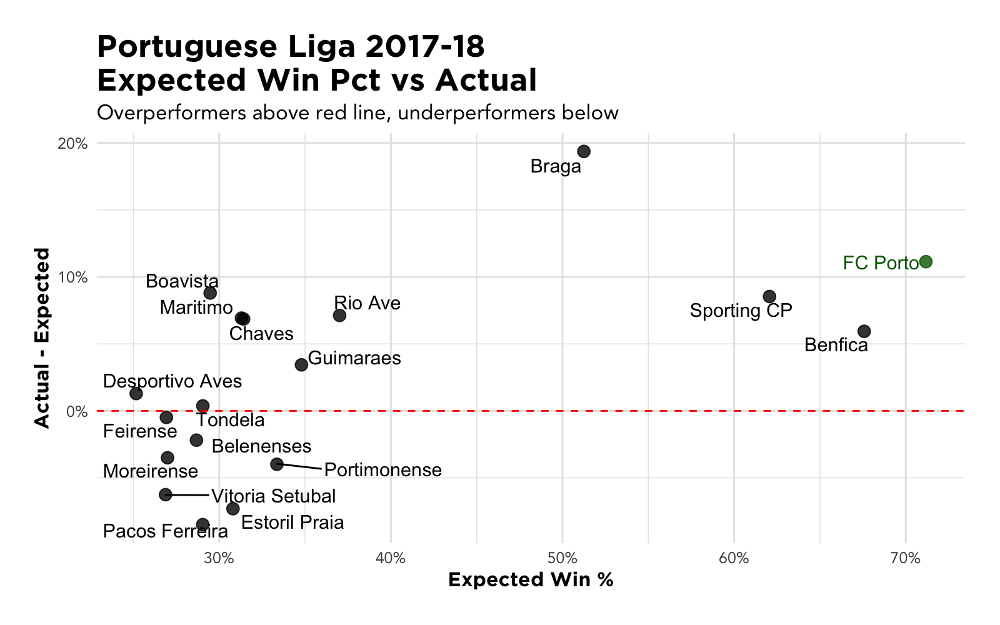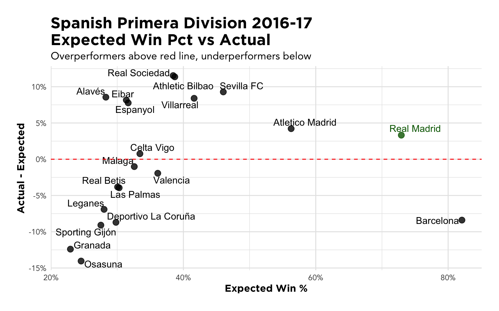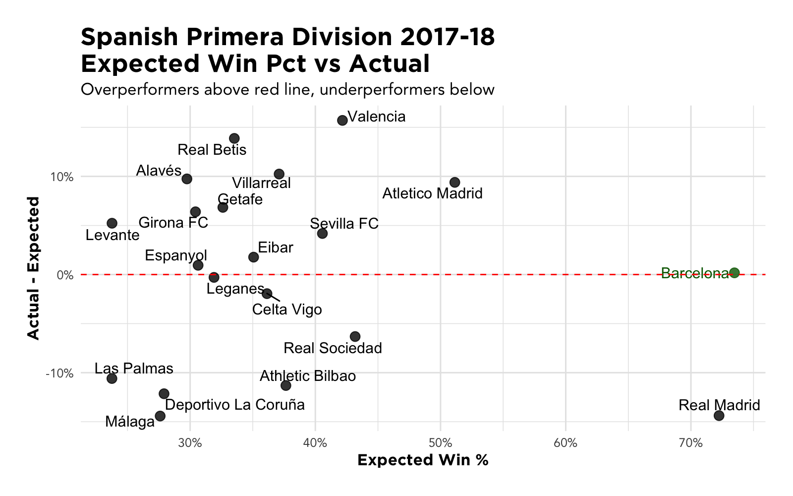


## Analysis Ideas
- Predicting promotion and relegation
- Classifying which games were played in neutral venues
- Overperformers and underperformers
- Predicting winners
- How does time between previous game affect team performance?
